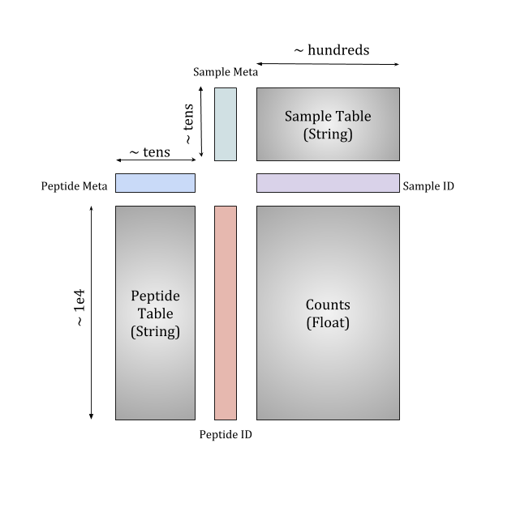

## Pan-CoV PhIP-Seq Manuscript Repository

This repository contains all necessary code for analysis described in <>
The repository contains the code for a [Nextflow](https://www.nextflow.io/docs/latest/getstarted.html) pipeline,
dubbed [phip-flow](https://github.com/matsengrp/phip-flow), that produces an xarray dataset 

Once this dataset is obtained, the jupyter notebooks containing all analysis may be run using the environment
provided here along with the [phippery](git@github.com:matsengrp/phippery.git) package installed

### Running the alignment pipeline

All raw fastq files for the samples can be obtained upon request and will be provided in a tarball, NGS.tar.
place this file in the alignment pipeline directory and run `tar -xvf NGS.tar` to produce the `NGS` Directory.

The pipeline can be run anywhere with `Nextflow` and `Docker`/`Singularity` installed. 
The scripts inside the directory provide an example of how to run the pipeline on our local cluster, gizmo.

To configure 

containing sample and peptide metadata tied to the raw counts matrix like so:

With the colored columns representing coordinate dimensions and the grey squares representing data arrays
organized by respective shared dimensions.

<p align="center">
  
</p>

### Running the analysis notebooks

Upon request, we can also provide you with the pre-aligned xarray dataset described above in a
[Pickle]() dumped binary file, named `pan-cov-ds.phip`. This is the file generated from the pipeline
described above, as well as the only file you'll need to run all the analysis notebooks.

We suggest using [conda]() to create the environment like so:
```
conda env create -f environment.yml && conda activate pan-cov-manuscript
mkdir -p _ignore && cd _ignore
git clone git@github.com:matsengrp/phippery.git
cd phippery && python setup.py install --user && cd ../../
```
Once obtained, place the `pan-cov-ds.phip` into the `_ignore` directory then simply
```
cd analysis-notebooks
jupyter notebook
```
to launch jupyter notebooks.

**Full-Pan-CoV-Analysis.ipynb**

This notebook contains all analysis run for the manuscript using custom code from 
[phippery]()
and a number of popular python packages.
By selecting the "Kernal" -> "restart and run all"
the notebook will run all analysis and create a diretory with all plots.
The parameters up top may easily changed to see how results change at different FPR or metrics
for ranking peptides.


